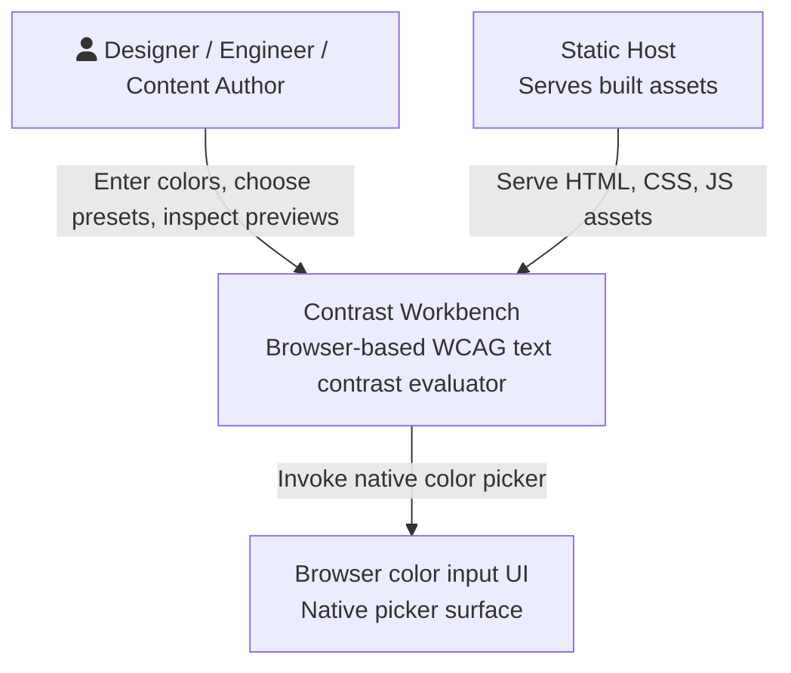
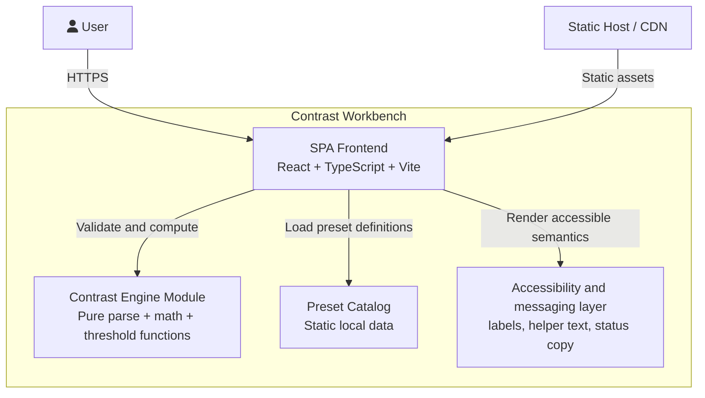
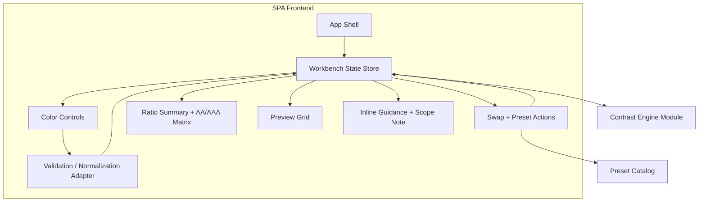
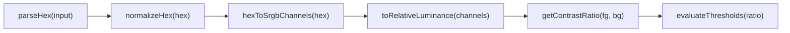
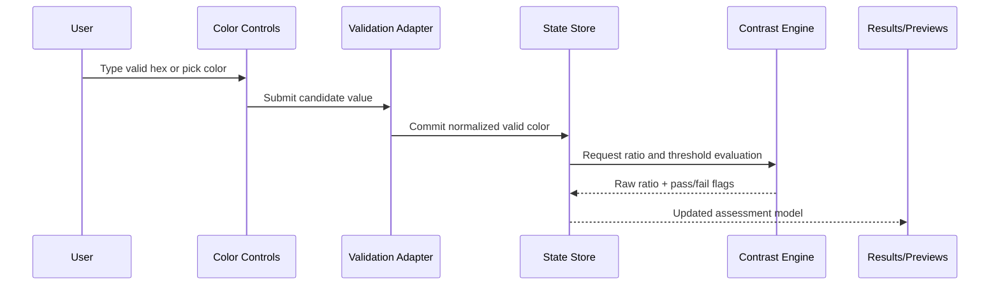
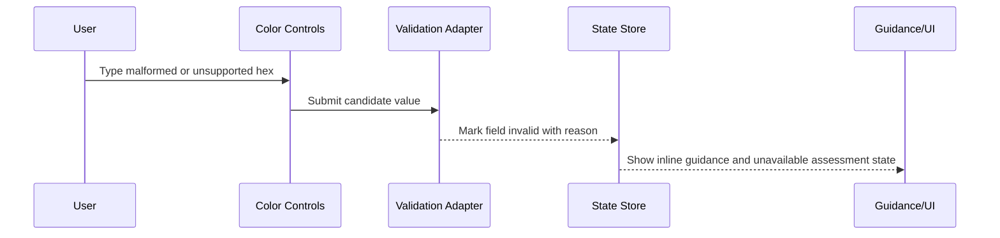
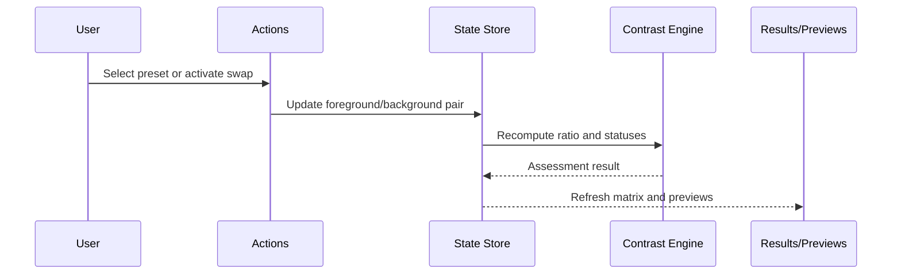
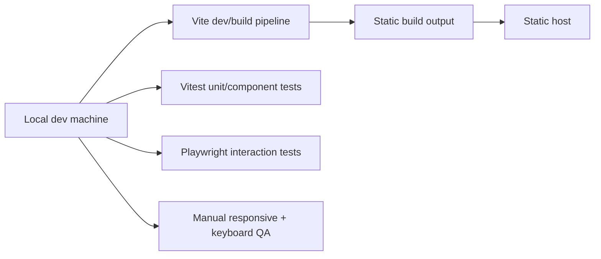

# C4 Architecture -- contrast-workbench-spark-0606

## Architecture Summary

The approved scope does not justify a backend. The product should be a static single-page web app that performs parsing, validation, contrast calculations, and preview rendering entirely in the browser. The preferred stack is React + TypeScript + Vite, with a framework-agnostic contrast engine module and local automated tests via Vitest and Playwright.

## Key Architectural Decisions

| Decision | Choice | Rationale |
|----------|--------|-----------|
| Runtime shape | Static SPA | No server value for local calculations and preset data |
| UI framework | React + TypeScript + Vite | Fast iteration for synchronized state across controls, results, and previews |
| Calculation engine | Pure TypeScript module | Makes WCAG math easy to unit test and trust |
| Preset storage | Static local module or JSON asset | No persistence or API dependency needed |
| Test strategy | Vitest plus Playwright | Separates math correctness from interaction correctness |

## Level 1: System Context

### Context Boundaries

- The system owns hex parsing, validation, normalization, contrast calculation, status evaluation, and preview rendering.
- The browser and OS own the visual presentation of the native color picker.
- The static host serves files only. It is not an application backend.
- No database, authentication, or third-party API participates in v1.

## Level 2: Container Diagram

### Container Notes

- `SPA Frontend` owns view composition, responsive layout, input state, and interaction orchestration.
- `Contrast Engine Module` remains framework-agnostic and contains all trusted WCAG-related logic.
- `Preset Catalog` is bundled into the build and versioned with the app.
- `Accessibility and messaging layer` is not a separate runtime service; it is a design boundary covering helper copy, labels, and result communication patterns.

## Level 3: Component Diagram

### Component Responsibilities

| Component | Responsibility |
|----------|----------------|
| App Shell | Semantic landmarks, section layout, top-level composition |
| Workbench State Store | Raw field state, normalized valid values, active preset id, assessment state |
| Color Controls | Foreground/background text inputs and native pickers |
| Validation / Normalization Adapter | Parse raw user input, normalize valid hex, expose unsupported-format guidance |
| Swap + Preset Actions | Apply inversion and preset selections while keeping state transitions explicit |
| Ratio Summary + AA/AAA Matrix | Present `X.XX:1` plus four threshold outcomes |
| Preview Grid | Render heading, body, button, and muted-text samples using the current pair |
| Inline Guidance + Scope Note | Show invalid-input help, unavailable-state language, and product scope note |

## Level 4: Contrast Engine Module

### Contrast Engine Contract

| Function Area | Output |
|---------------|--------|
| Parsing | Valid or invalid opaque hex result with reason code |
| Normalization | Canonical six-digit uppercase hex |
| Math | Raw contrast ratio as numeric value |
| Formatting | Display string such as `4.62:1` |
| Threshold evaluation | `aa_normal`, `aa_large`, `aaa_normal`, `aaa_large` boolean flags |

## Runtime Flows

### Valid Input Change

### Invalid Input Change

### Preset Or Swap Action

## State Ownership

| State | Owner | Notes |
|-------|-------|-------|
| Raw foreground/background field text | SPA state store | Needed for non-destructive typing and validation |
| Last valid normalized pair | SPA state store | Used for picker sync and recovery when raw input returns to valid form |
| Contrast assessment result | Derived from engine output | Recomputed from current valid pair only |
| Active preset id | SPA state store | Cleared on manual edit |
| Helper text and invalid reasons | Validation adapter + UI layer | Must stay close to the affected control |

## Deployment And Test Topology

## Verification Strategy

| Verification Area | Focus |
|-------------------|-------|
| Unit tests | Parser acceptance/rejection, luminance math, raw ratio accuracy, threshold edges |
| Interaction tests | Typing, picker sync, swap, preset selection, invalid guidance, and unavailable state |
| Accessibility checks | Labels, focus order, keyboard reachability, non-color-only statuses |
| Responsive QA | `375px`, `768px`, `1024px`, and `1440px` representative views |
| Build verification | Static production build with no backend dependency |

## Implementation Decomposition

These slices are ready to become issues after approval and build authorization.

| Decomposition Slice | Primary Deliverable | Requirement IDs |
|---------------------|---------------------|-----------------|
| Slice 1 | App shell, semantic structure, responsive layout scaffold | REQ-008, NFR-002, NFR-003, NFR-008 |
| Slice 2 | Validation adapter, hex parsing, normalization, picker sync | REQ-001, REQ-002, NFR-001, NFR-005 |
| Slice 3 | Pure contrast engine and result-matrix rendering | REQ-003, REQ-004, NFR-001, NFR-007 |
| Slice 4 | Swap action, preset catalog, preview-grid behaviors | REQ-005, REQ-006, REQ-007, NFR-005, NFR-006 |
| Slice 5 | Automated tests, accessibility verification, release checks | REQ-001, REQ-002, REQ-003, REQ-004, REQ-006, REQ-008, NFR-002, NFR-004, NFR-007 |
