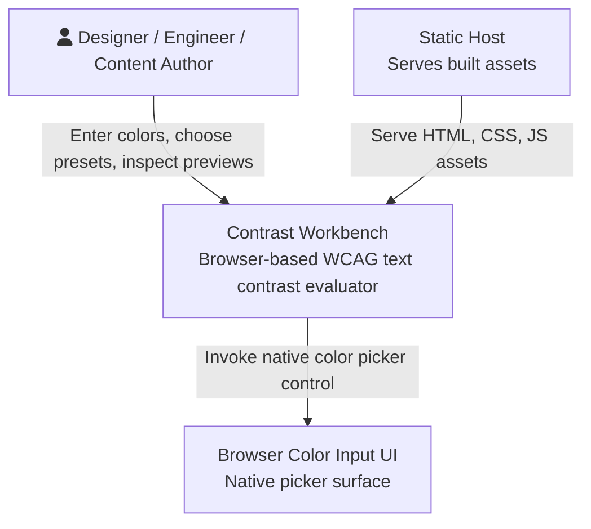
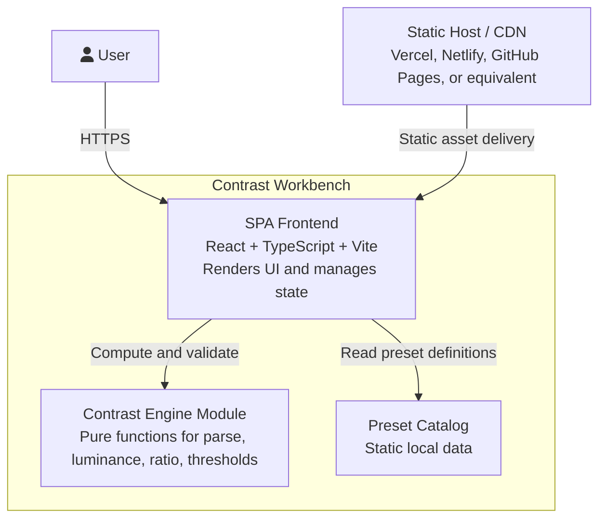
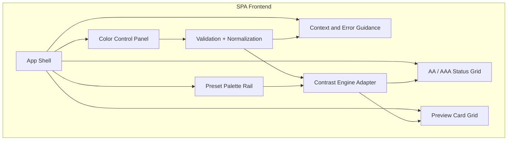
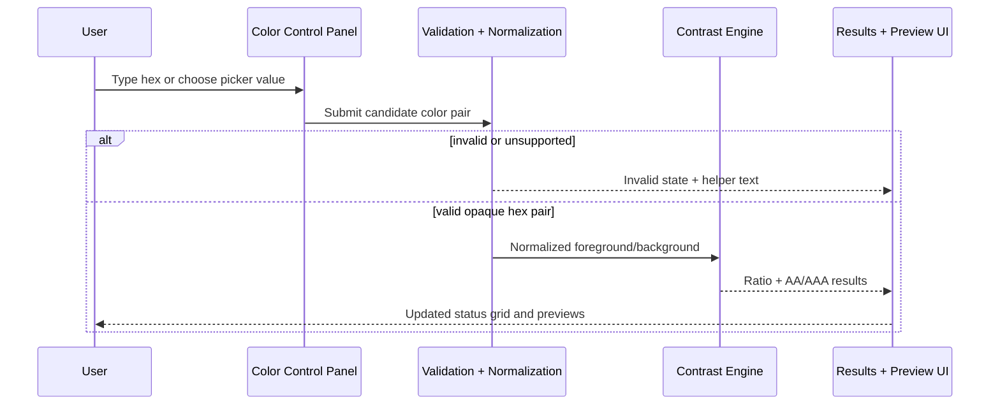
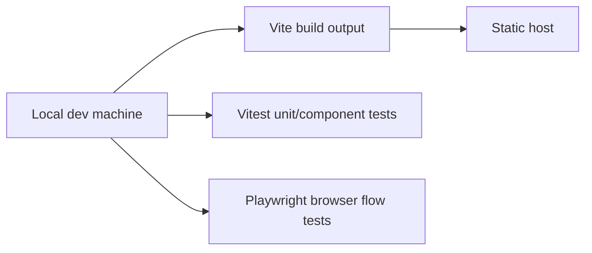

# C4 Architecture -- contrast-workbench-spark-0606

## Architecture Summary

The approved scope does not justify a backend. The product should be a static single-page web app that performs all parsing, validation, contrast calculations, and preview rendering in the browser. This keeps deployment simple, eliminates runtime network dependencies, and makes local testing straightforward.

## Level 1: System Context

### Context Boundaries

- The system is responsible for parsing opaque hex values, computing contrast, and rendering results.
- The browser or OS is responsible for the native presentation of the color picker.
- The static host is only an asset delivery mechanism, not an application backend.
- No database, user account system, or third-party API exists in v1.

## Level 2: Container Diagram

### Container Notes

- `SPA Frontend` owns interaction flow, responsive layout, accessibility semantics, and state transitions.
- `Contrast Engine Module` should remain framework-agnostic for easy unit testing.
- `Preset Catalog` should be a static local module or JSON asset bundled with the app.

## Level 3: Component Diagram

### Component Responsibilities

| Component | Responsibility |
|----------|----------------|
| App Shell | Layout, section orchestration, and top-level state container |
| Color Control Panel | Foreground/background text fields, pickers, swap action |
| Validation + Normalization | Accept `#RGB` and `#RRGGBB`, reject unsupported syntax, normalize valid input |
| Contrast Engine Adapter | Calls pure contrast functions and maps outputs to UI-ready result objects |
| AA / AAA Status Grid | Shows threshold-specific outcomes with text and icon cues |
| Preset Palette Rail | Applies curated color pairs and tracks active preset state |
| Preview Card Grid | Renders heading, body, button, and muted text samples with selected colors |
| Context and Error Guidance | Explains thresholds, unsupported inputs, and stale or unavailable states |

## Runtime Flow

## Deployment And Test Shape

## Implementation Decomposition

These slices are ready to become issues only after the Executive Brief is approved or auto-started.

| Decomposition Slice | Primary Deliverable | Requirement IDs |
|---------------------|---------------------|-----------------|
| Slice 1 | App shell, responsive layout scaffold, semantic landmarks | REQ-008, NFR-002, NFR-003 |
| Slice 2 | Hex parsing, normalization, inline validation, swap action | REQ-001, REQ-002, REQ-006, NFR-001, NFR-005 |
| Slice 3 | Contrast engine and threshold grid | REQ-003, REQ-004, NFR-001 |
| Slice 4 | Preview cards and preset interactions | REQ-005, REQ-007, NFR-002, NFR-003 |
| Slice 5 | Automated tests, QA harness, release checks | REQ-001, REQ-003, REQ-004, REQ-008, NFR-004, NFR-005, NFR-006 |
