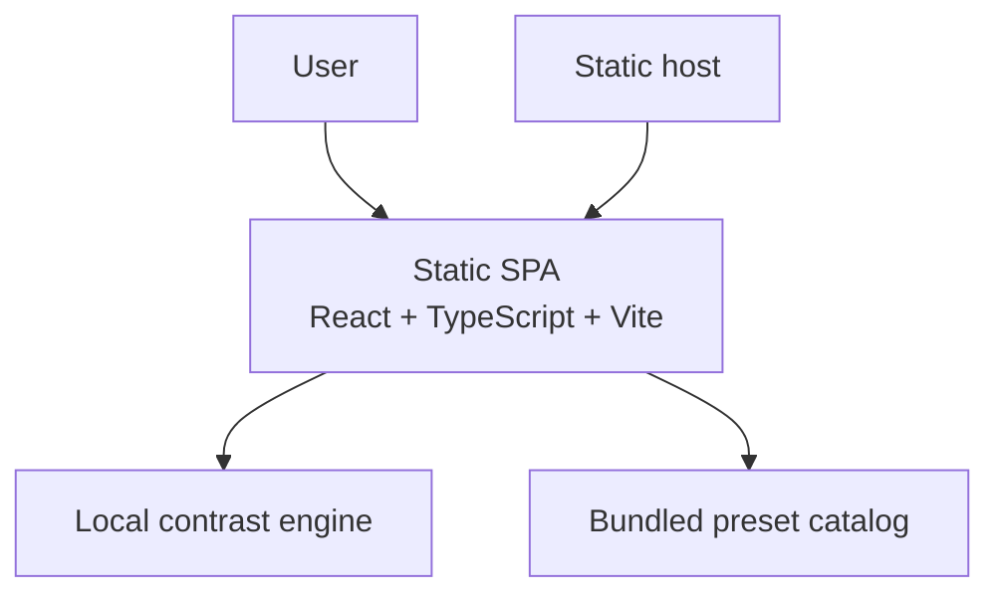

# Executive Brief -- contrast-workbench-spark-0606

> **Status:** Awaiting approval
> **Autonomy level:** High-assurance
> **Created:** 2026-04-06
> **Project type:** Browser-based accessibility utility
> **Project traits:** client-side, responsive, WCAG-grounded, testable

## What We Think You Want

You want a polished web workbench that lets someone enter or pick a text color and background color, instantly see the WCAG contrast ratio, understand AA and AAA pass-fail status for normal and large text, and inspect the pair in realistic preview cards. You also want planning artifacts that are implementation-ready, explicit about scope, and grounded in current accessibility constraints rather than generic product prose.

## What We Will Build

- A single responsive workbench with synchronized hex inputs, native color pickers, a swap action, and curated starter presets.
- A deterministic WCAG contrast engine that reports ratio plus AA and AAA outcomes for normal and large text.
- Live preview cards for heading, body, button, and muted text, with clear invalid-input guidance and local automated test expectations.

## Key Screen Preview

  

    <b>Contrast Workbench</b>
    12.63:1
  

  

    

      Foreground `#1F2937` 
      Background `#F9FAFB`  
      [Swap] [Preset chips]
    

    

      
AA / AAA results grid

      

        
Heading preview

        
Body preview

        
Button preview

        
Muted preview

      

    

  

## What We Will NOT Build

- Live site crawling, extension-style DOM inspection, or page-wide audit reports.
- Transparency, gradients, overlays, or image-based contrast analysis in v1.
- Accounts, saved workspaces, collaboration, or hosted APIs.

## Scope Snapshot

- Requirements in scope: `8` user requirements, `6` non-functional requirements.
- Runtime footprint: one static SPA, no backend, no database.
- Primary user flow: edit colors -> validate -> compute ratio -> inspect status grid -> inspect previews -> try presets or swap.

## Top Risks

| Risk | Impact | Mitigation |
|------|--------|-----------|
| Ambiguous support for alpha or advanced color formats | Users may trust incorrect results | Explicitly scope v1 to opaque hex and reject unsupported formats with guidance |
| Pass-fail rounding mistakes near thresholds | Tool becomes untrustworthy for real accessibility decisions | Unit-test threshold edge cases and compare raw values before formatting |
| Overly decorative UI harms usability on mobile | Product looks polished but is harder to use | Keep one-screen hierarchy, prioritize control/result visibility, verify focus order and overflow at mobile widths |

## Recommended Approach

Build this as a static React + TypeScript + Vite single-page app with a pure contrast engine module, bundled preset data, and local automated tests using Vitest plus a small Playwright flow suite. This is the simplest architecture that still supports polished UI behavior, accurate state synchronization, and reliable verification of accessibility-sensitive interactions.

## Implementation Decomposition

Issue creation is intentionally deferred until approval. These are the approved requirement slices to issueize afterward.

| Planned Slice | Outcome | Requirement IDs |
|--------------|---------|-----------------|
| Slice A | Responsive shell and semantic layout | REQ-008, NFR-002, NFR-003 |
| Slice B | Input parsing, normalization, validation, swap | REQ-001, REQ-002, REQ-006, NFR-001, NFR-005 |
| Slice C | Contrast engine and pass-fail results | REQ-003, REQ-004, NFR-001 |
| Slice D | Presets and preview cards | REQ-005, REQ-007, NFR-002, NFR-003 |
| Slice E | Local test suite and QA gate | REQ-001, REQ-003, REQ-004, REQ-008, NFR-004, NFR-005, NFR-006 |

## Estimated Scope

- **Issues after approval:** ~5
- **Complexity:** Medium
- **Estimated time:** 2 to 3 implementation days plus review and polish

## Detailed Docs

- [Research -- Knowledge Tree](../research/knowledge-tree.md)
- [Product Requirements (PRD)](../prd/project-prd.md)
- [UX Specification](../ux/ux-spec.md)
- [Architecture (C4)](../architecture/c4.md)
