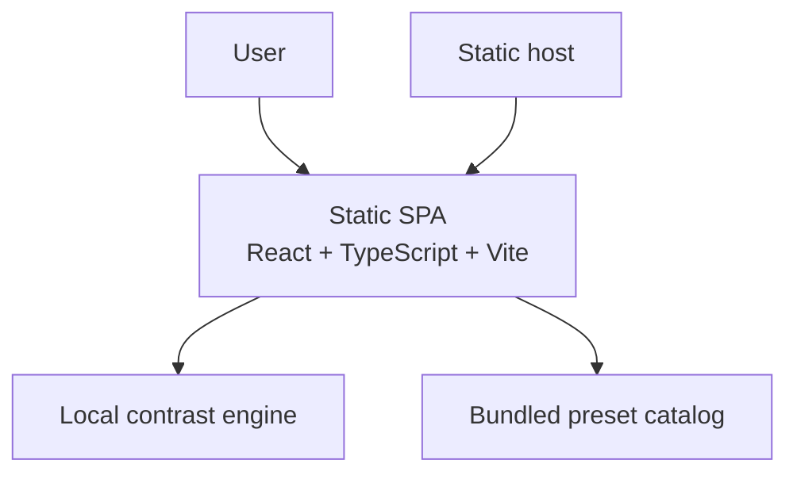
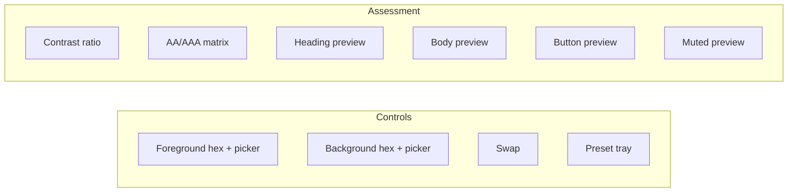

# Executive Brief -- contrast-workbench-spark-0606

> **Status:** Approved for build authorization
> **Autonomy level:** High-assurance
> **Created:** 2026-04-06
> **Approved:** 2026-04-06T07:07:01Z
> **Project type:** Browser-based accessibility utility
> **Project traits:** client-side, responsive, WCAG-grounded, testable

## What We Think You Want

You want a polished browser-based accessibility workbench that lets a user enter or pick foreground and background colors, instantly see the WCAG contrast ratio, understand AA and AAA pass/fail status for normal and large text, and preview the pair in realistic UI samples. You also want the planning set to be concrete enough that build work can start without reopening basic product, UX, or architecture questions.

## What We Will Build

- A single responsive workbench with synchronized hex inputs, native color pickers, a keyboard-safe swap action, and curated starter presets.
- A deterministic WCAG contrast engine that reports ratio plus AA and AAA outcomes for normal and large text without rounding errors.
- Live preview cards for heading, body, button, and muted/supporting text, backed by invalid-input guidance and local automated tests.

## Key Screen Preview

## What We Will Not Build

- Live site crawling, browser-extension-style DOM inspection, or page-wide audit reports.
- Transparency, gradients, overlays, or image-based contrast analysis in v1.
- Accounts, saved workspaces, collaboration, exports, or hosted APIs.

## Scope Snapshot

- Requirements in scope: `8` functional requirements and `8` non-functional requirements.
- Runtime footprint: one static SPA, no backend, no database.
- Primary user flow: edit or pick colors -> validate -> compute ratio -> inspect AA/AAA matrix -> inspect previews -> compare with presets or swap.
- Verification plan: local unit coverage for parsing and math, local browser coverage for user flows, responsive and keyboard QA.

## Top Risks

| Risk | Impact | Mitigation |
|------|--------|-----------|
| Invalid-state handling feels unstable or misleading | Users lose trust in the workbench | Keep raw text state separate from last valid normalized state and switch invalid input to a clear neutral `Unavailable` state |
| Threshold-edge math is implemented incorrectly | Tool gives false accessibility guidance | Use a pure engine with unit tests around `3`, `4.5`, and `7` |
| Desktop polish compromises mobile clarity | Product looks refined but becomes harder to use on phones | Preserve one-screen hierarchy and verify section order, overflow, and focus behavior at mobile widths |

## Recommended Approach

Build this as a static React + TypeScript + Vite single-page app with a framework-agnostic contrast engine module, bundled preset data, and local automated tests using Vitest plus Playwright. This is the simplest architecture that still supports polished UI behavior, precise state synchronization, and reliable verification of accessibility-sensitive interactions.

## Build Authorization

Planning is complete and the project is ready to move into implementation. Issue creation and build work may proceed against the requirement slices below.

## Implementation Decomposition

| Planned Slice | Outcome | Requirement IDs |
|--------------|---------|-----------------|
| Slice A | Responsive shell and semantic layout | REQ-008, NFR-002, NFR-003, NFR-008 |
| Slice B | Input parsing, normalization, validation, and picker sync | REQ-001, REQ-002, NFR-001, NFR-005 |
| Slice C | Contrast engine and pass/fail matrix | REQ-003, REQ-004, NFR-001, NFR-007 |
| Slice D | Swap, presets, and preview cards | REQ-005, REQ-006, REQ-007, NFR-005, NFR-006 |
| Slice E | Local tests, accessibility checks, and release gate | REQ-001, REQ-002, REQ-003, REQ-004, REQ-006, REQ-008, NFR-002, NFR-004, NFR-007 |

## Estimated Scope

- **Issues after approval:** ~5 implementation slices
- **Complexity:** Medium
- **Estimated time:** 2 to 3 implementation days plus review and polish

## Detailed Docs

- [Research -- Knowledge Tree](../research/knowledge-tree.md)
- [Product Requirements (PRD)](../prd/project-prd.md)
- [UX Specification](../ux/ux-spec.md)
- [Architecture (C4)](../architecture/c4.md)
