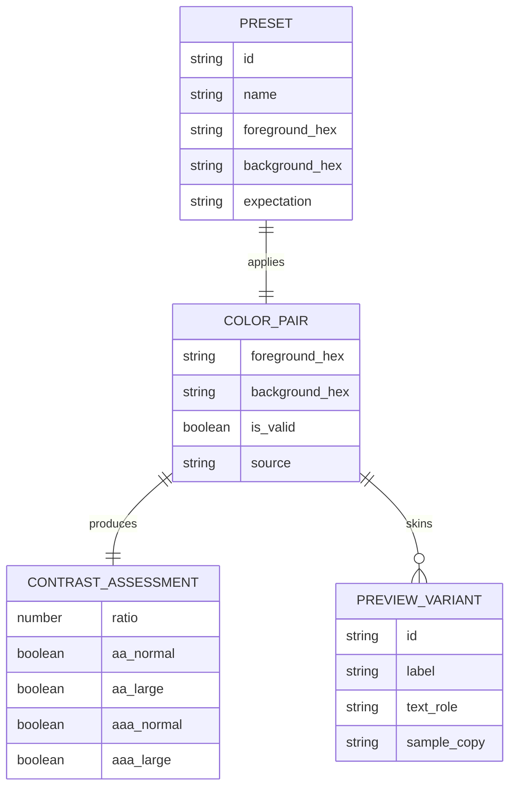

# Product Requirements -- contrast-workbench-spark-0606

## Overview

`contrast-workbench-spark-0606` is a browser-based accessibility workbench for quickly evaluating text/background color contrast and previewing accessible combinations in realistic UI samples. It is for designers, frontend engineers, and content authors who need fast WCAG-based answers without leaving the browser or setting up a design tool plugin.

## Goals

1. Let users enter or pick two colors and get an accurate WCAG contrast ratio immediately.
2. Translate the ratio into clear AA and AAA pass-fail outcomes for normal and large text.
3. Help users judge the pair in context through responsive, polished preview cards and curated starting palettes.

## Non-Goals

- Full-page auditing of arbitrary websites or DOM inspection of live pages.
- Support for alpha, gradients, blend modes, images, or non-hex freeform color syntax in v1.
- User accounts, cloud persistence, collaboration, exports, or design-tool plugins.

## Personas

### Persona A: Frontend Engineer

Needs a deterministic answer for a candidate text/background pair and wants confidence that the displayed result matches WCAG math and edge cases.

### Persona B: Product Designer

Needs to try several branded combinations quickly, compare them in common UI patterns, and start from curated presets instead of a blank canvas.

### Persona C: Content Author

Needs simple guidance when a chosen color pair is unreadable or invalid and does not want to understand the full formula to act correctly.

## User Stories

### Color Entry And Validation

- **REQ-001** As a frontend engineer, I want to enter foreground and background colors as hex values or with simple color pickers so that I can test exact color pairs quickly.
  - Acceptance criteria:
    - [ ] The workbench exposes a foreground control and a background control, each with a hex text field and a synchronized native color picker.
    - [ ] The product accepts `#RGB` and `#RRGGBB` input, normalizes shorthand to six-digit hex for internal use, and preserves a leading `#` in the visible field.
    - [ ] Changing either the text field or picker updates the paired control and recalculates results without a manual submit action.

- **REQ-002** As a content author, I want clear guidance when a color value is invalid so that I can recover without guessing what broke.
  - Acceptance criteria:
    - [ ] Invalid values show inline helper text that explains the accepted format and identifies alpha or unsupported syntax as out of scope.
    - [ ] The UI does not crash, blank the screen, or show a fake pass-fail result when either input is invalid.
    - [ ] The last valid assessment remains visible until both inputs are valid again or is clearly replaced by a neutral "needs valid colors" state.

### Contrast Assessment

- **REQ-003** As a frontend engineer, I want the tool to calculate the WCAG contrast ratio accurately so that I can rely on it for implementation decisions.
  - Acceptance criteria:
    - [ ] The app computes contrast using the WCAG sRGB relative luminance formula and displays the ratio in `X.XX:1` format.
    - [ ] Pass-fail logic uses the full computed ratio and does not round before threshold comparison.
    - [ ] The ratio updates within the same interaction cycle as input changes and is visible without scrolling on desktop.

- **REQ-004** As a designer, I want AA and AAA outcomes for normal and large text so that I can understand where a pair is acceptable.
  - Acceptance criteria:
    - [ ] The results panel shows four labeled outcomes: AA normal text, AA large text, AAA normal text, and AAA large text.
    - [ ] Each outcome uses text labels or icons in addition to color to indicate pass or fail.
    - [ ] Large-text messaging explains that the relaxed threshold applies only to large-scale text, not all text in the previews.

### Preview And Exploration

- **REQ-005** As a designer, I want live preview cards for heading text, body text, buttons, and muted text so that I can judge the chosen pair in realistic contexts.
  - Acceptance criteria:
    - [ ] The workbench shows at least four preview variants: heading, body copy, primary button, and muted/supporting text.
    - [ ] Preview content updates immediately when the active colors change.
    - [ ] Preview labels make the sample role explicit so users do not confuse sample cards with a compliance guarantee for every UI use.

- **REQ-006** As a designer, I want a one-click swap action so that I can compare inverse foreground/background usage quickly.
  - Acceptance criteria:
    - [ ] A swap control exchanges the current foreground and background values in one interaction.
    - [ ] Swap preserves validity state and triggers immediate recalculation and preview refresh.
    - [ ] The action is available by keyboard and has an accessible name.

- **REQ-007** As a designer, I want curated starter palettes or presets so that I can begin from useful combinations instead of an empty state.
  - Acceptance criteria:
    - [ ] The app ships with a finite curated preset list that includes both passing and intentionally failing examples for comparison.
    - [ ] Selecting a preset applies both colors and updates the ratio, status grid, and previews.
    - [ ] The active preset is visually indicated until the user edits either color manually.

### Layout And Device Support

- **REQ-008** As a mobile user, I want the workbench to remain usable on a phone so that I can check colors away from my desk.
  - Acceptance criteria:
    - [ ] At widths from `375px` and up, controls, results, presets, and preview cards stack in a readable order without horizontal scrolling.
    - [ ] On desktop, the input/result area and preview area are both accessible without excessive scrolling on a common laptop viewport.
    - [ ] Focus order follows the visual order in both desktop and mobile layouts.

## Non-Functional Requirements

| ID | Requirement | Target | How to Verify |
|----|-------------|--------|---------------|
| NFR-001 | Calculation correctness | Ratio matches WCAG 2.2 sRGB formula; pass-fail thresholds applied without rounding | Unit tests against known color pairs and threshold edge cases |
| NFR-002 | App accessibility | Workbench UI meets WCAG AA for labels, keyboard flow, visible focus, and non-color-only status cues | Manual keyboard QA plus automated accessibility scan |
| NFR-003 | Responsive support | Usable from `375px` mobile through `1440px` desktop with no horizontal overflow in primary flow | Visual QA at representative viewports |
| NFR-004 | Runtime performance | Initial render and first interaction feel immediate on a local static build; no network dependency for core functionality | Lighthouse run plus manual throttled interaction check |
| NFR-005 | Robustness | Invalid input, repeated swaps, and rapid typing do not throw uncaught errors or produce stale UI state | Automated interaction tests and browser console capture |
| NFR-006 | Local automated testability | Project includes local automated tests for parser/calculation logic and at least one end-to-end happy-path interaction flow | `vitest` and browser or E2E test run in local CI command |

## Data Model

## API Contracts

No network API is required for v1. All calculations, validation, preset selection, and previews happen in the client.

## Implementation Decomposition

This section defines post-approval work slices only. It is not an issue list.

| Slice | Scope | Requirement IDs |
|------|-------|-----------------|
| Workstream A | App shell, responsive layout, semantic structure, and keyboard-safe control layout | REQ-001, REQ-008, NFR-002, NFR-003 |
| Workstream B | Hex parsing, normalization, invalid-state messaging, and swap interaction | REQ-001, REQ-002, REQ-006, NFR-001, NFR-005 |
| Workstream C | WCAG contrast engine and results matrix | REQ-003, REQ-004, NFR-001 |
| Workstream D | Preview cards and curated preset catalog behavior | REQ-005, REQ-007, NFR-002, NFR-003 |
| Workstream E | Local automated tests and release-ready QA criteria | REQ-001, REQ-002, REQ-003, REQ-004, REQ-006, REQ-008, NFR-004, NFR-005, NFR-006 |
