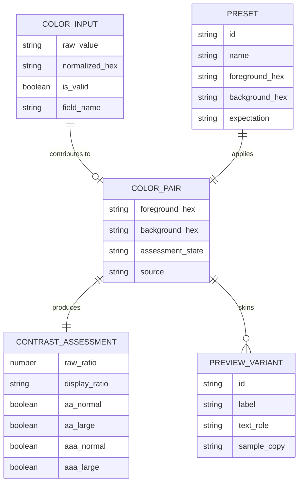
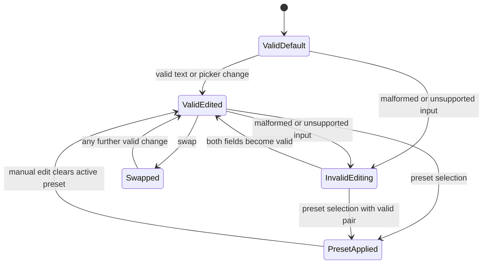

# Product Requirements -- contrast-workbench-spark-0606

## Overview

`contrast-workbench-spark-0606` is a browser-based accessibility workbench for evaluating flat text/background color contrast and previewing accessible combinations in realistic UI samples. It is intended for designers, frontend engineers, and content authors who need a fast, trustworthy WCAG-based answer without leaving the browser.

## Problem Statement

Existing contrast tools often stop at a raw ratio, underspecify invalid states, or make it hard to judge a color pair in context. This project should close that gap with a polished, browser-first workbench that couples correct math with clear status communication and realistic live previews.

## Goals

1. Let users enter or pick a foreground/background pair and get an accurate WCAG contrast ratio immediately.
2. Translate that ratio into explicit AA and AAA pass/fail outcomes for normal and large text.
3. Make the result actionable through labeled preview cards, curated presets, and recoverable invalid-input guidance.
4. Keep the implementation lightweight, static, and locally testable.

## Non-Goals

- Auditing arbitrary live pages, scraping DOM content, or crawling sites.
- Supporting alpha channels, gradients, image backgrounds, overlays, or non-hex freeform CSS color syntax in v1.
- User accounts, cloud persistence, exports, collaboration, or design-tool plugins.

## Personas

### Persona A: Frontend Engineer

Needs deterministic output that matches WCAG math exactly, including threshold edge cases, so the chosen pair can be implemented with confidence.

### Persona B: Product Designer

Needs to explore combinations quickly, compare foreground/background directionality, and start from curated palettes rather than an empty form.

### Persona C: Content Author

Needs plain-language guidance when a color pair is invalid or fails contrast, without needing to understand the full formula.

## Functional Requirements

### REQ-001: Dual Color Entry

As a user, I want both foreground and background controls to support hex entry and native color picking so that I can test exact pairs quickly.

Acceptance criteria:

- [ ] The workbench exposes one foreground control and one background control.
- [ ] Each control includes a visible hex text input and a synchronized native color picker.
- [ ] The product accepts `#RGB` and `#RRGGBB`, preserves a leading `#`, and normalizes valid input to six-digit uppercase hex for calculation and picker sync.
- [ ] Changing either the text field or picker updates the paired control and recalculates results without a submit action.

### REQ-002: Invalid Color Guidance

As a user, I want invalid or unsupported color input to be recoverable so that I can fix it without guessing or losing context.

Acceptance criteria:

- [ ] Invalid values show inline helper text near the affected field.
- [ ] Guidance explicitly states that only opaque hex is supported in v1 and that transparency syntax is out of scope.
- [ ] The UI does not crash, blank the page, or display a fresh pass/fail result for invalid inputs.
- [ ] While one or both inputs are invalid, the assessment area shows a neutral `Unavailable` state instead of an authoritative ratio or pass/fail result.

### REQ-003: WCAG Contrast Calculation

As a frontend engineer, I want the displayed contrast ratio to match WCAG math so that I can trust the tool for implementation decisions.

Acceptance criteria:

- [ ] The app computes contrast using the WCAG sRGB relative luminance formula.
- [ ] The ratio is displayed in `X.XX:1` format.
- [ ] Threshold comparisons use the raw computed ratio and do not round before evaluating success.
- [ ] The ratio updates in the same interaction cycle as a valid input change.

### REQ-004: AA And AAA Outcome Matrix

As a designer, I want explicit pass/fail outcomes for normal and large text so that I can tell where a pair is acceptable.

Acceptance criteria:

- [ ] The results panel shows four labeled outcomes: AA normal text, AA large text, AAA normal text, and AAA large text.
- [ ] Each outcome communicates `Pass`, `Fail`, or `Unavailable` using text and an icon or shape cue, not color alone.
- [ ] Large-text guidance is shown near the matrix or in adjacent helper copy.

### REQ-005: Live Preview Cards

As a designer, I want realistic preview cards so that I can judge the chosen pair in common UI contexts.

Acceptance criteria:

- [ ] The workbench includes at least four labeled preview variants: heading, body copy, primary button, and muted/supporting text.
- [ ] Preview cards update immediately after valid color changes.
- [ ] Preview labels make the sample role explicit so the UI does not imply universal compliance.

### REQ-006: Swap Action

As a designer, I want a one-step swap action so that I can compare reversed foreground/background usage quickly.

Acceptance criteria:

- [ ] A swap control exchanges the current foreground and background values in one interaction.
- [ ] The swap control is keyboard reachable and has an accessible name.
- [ ] Swap triggers immediate recalculation and preview refresh.
- [ ] If either field is invalid, the product does not fabricate a valid result during swap handling.

### REQ-007: Curated Presets

As a designer, I want curated starter combinations so that I can begin from useful examples instead of an empty state.

Acceptance criteria:

- [ ] The app ships with a finite local preset catalog that includes both passing and intentionally failing examples.
- [ ] Selecting a preset applies both colors and updates the ratio, status matrix, and previews immediately.
- [ ] The active preset is visually indicated.
- [ ] Any manual edit to either color clears active-preset styling.

### REQ-008: Responsive Single-Screen Workbench

As a mobile or desktop user, I want the workbench to stay usable across viewport sizes so that I can assess colors without layout friction.

Acceptance criteria:

- [ ] At widths from `375px` and up, the workbench is usable without horizontal scrolling in the primary flow.
- [ ] On desktop widths from `1024px` and up, controls/results and previews are visible in the same overall viewport on a common laptop-sized screen.
- [ ] On mobile, sections appear in a stacked order that preserves the workflow: inputs, swap, result summary, presets, previews.
- [ ] Focus order follows visual order on both desktop and mobile layouts.

## Non-Functional Requirements

| ID | Requirement | Target | How To Verify |
|----|-------------|--------|---------------|
| NFR-001 | Calculation correctness | Ratio and thresholds match WCAG 2.2 sRGB math, including edge cases near `3`, `4.5`, and `7` | Unit tests with fixed fixtures and threshold-edge assertions |
| NFR-002 | UI accessibility | Keyboard-operable controls, visible focus, semantic labels, accessible helper text, and non-color-only status signals | Manual keyboard QA plus automated accessibility scan |
| NFR-003 | Responsive support | Primary flow remains usable from `375px` mobile through `1440px` desktop with no horizontal overflow | Visual QA at representative breakpoints |
| NFR-004 | Runtime performance | Initial load and first valid recalculation feel immediate on a local static build | Lighthouse plus manual throttled interaction check |
| NFR-005 | Robustness | Rapid typing, repeated swaps, invalid entry, and preset changes do not throw uncaught errors or leave contradictory UI state | Browser interaction tests and console inspection |
| NFR-006 | Browser-first operation | Core calculation, preset application, and preview updates require no network requests after the initial asset load | Browser network inspection during interaction |
| NFR-007 | Local automated testability | Repo includes local automated tests for parser, engine, and at least one end-to-end user flow | Local `vitest` and Playwright run |
| NFR-008 | Lightweight deployment shape | Production build is deployable as static assets with no backend runtime or persistence dependency | Build output inspection and deployment configuration review |

## Requirement Summary

- Functional requirements: `8`
- Non-functional requirements: `8`
- Total tracked requirements: `16`

## Data Model

## State Model

## API Contracts

No network API is required for v1. Parsing, validation, ratio calculation, status evaluation, preset application, and preview rendering all happen locally in the client.

## Release Gates

| Gate | Requirement IDs | Evidence Needed |
|------|-----------------|-----------------|
| Math trust gate | REQ-003, REQ-004, NFR-001 | Passing unit tests for ratio fixtures and threshold edges |
| Interaction trust gate | REQ-001, REQ-002, REQ-006, REQ-007, NFR-005 | Passing browser tests for typing, validation, swap, and preset flows |
| Responsive usability gate | REQ-005, REQ-008, NFR-003 | Desktop and mobile QA evidence with no horizontal overflow |
| Accessibility gate | REQ-002, REQ-004, REQ-008, NFR-002 | Keyboard walkthrough plus automated accessibility scan |
| Deployment gate | NFR-004, NFR-006, NFR-007, NFR-008 | Local build, test run, and static-host readiness verification |

## Implementation Decomposition

This section defines post-approval work slices only. It is not an issue list.

| Slice | Scope | Requirement IDs |
|------|-------|-----------------|
| Workstream A | App shell, semantic landmarks, responsive layout, and section hierarchy | REQ-008, NFR-002, NFR-003, NFR-008 |
| Workstream B | Hex parsing, normalization, invalid-state messaging, and picker synchronization | REQ-001, REQ-002, NFR-001, NFR-005 |
| Workstream C | Pure WCAG contrast engine and AA/AAA result matrix | REQ-003, REQ-004, NFR-001, NFR-007 |
| Workstream D | Swap interaction, preset catalog behavior, and live preview cards | REQ-005, REQ-006, REQ-007, NFR-005, NFR-006 |
| Workstream E | Local automated tests, accessibility checks, and release verification | REQ-001, REQ-002, REQ-003, REQ-004, REQ-006, REQ-008, NFR-002, NFR-003, NFR-004, NFR-007 |
