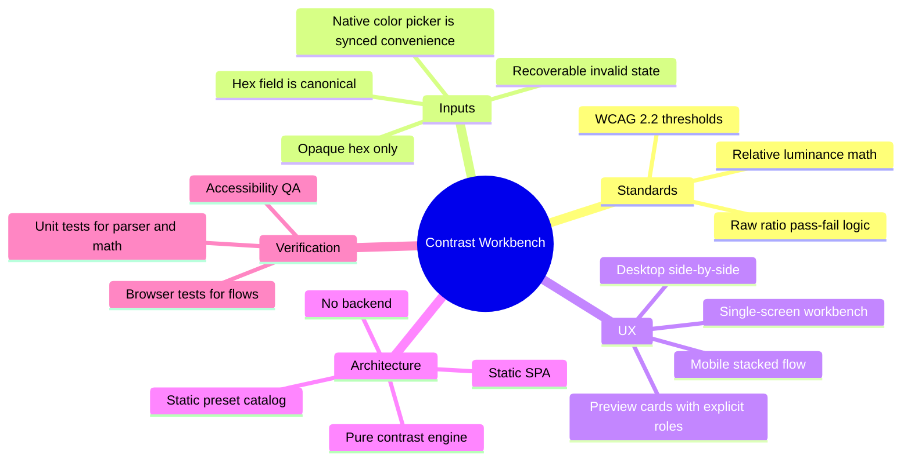

# Knowledge Tree -- contrast-workbench-spark-0606

## Executive Research Summary

- WCAG 2.2 text contrast remains the correct v1 baseline: `4.5:1` AA normal, `3:1` AA large, `7:1` AAA normal, and `4.5:1` AAA large.
- Pass/fail must be determined from the raw ratio, not the rounded display value. A formatted `3.00:1` can still fail if the underlying value is below `3`.
- The safest v1 input scope is opaque hex only. Alpha values and layered backgrounds require explicit compositing rules and create misleading results when treated as flat colors.
- Native browser color pickers are useful convenience controls, but their UI varies by browser and platform; typed hex must remain the canonical source of truth.
- The workbench should present realistic sample roles, not just a ratio. Users need heading, body, button, and muted-text previews to connect math to usage.
- A static browser app with a pure calculation engine and local automated tests is the implementation shape that best matches scope, speed, and correctness needs.

## Research Map

## DOK 1-2: Facts And Sources

### Domain Overview

This project sits between accessibility reference tooling and day-to-day product design work. Users do not only need a mathematically correct ratio; they need confidence that the tool handles edge cases correctly, explains invalid input clearly, and shows how a chosen pair behaves across common text roles on desktop and mobile.

### Implementation Questions Answered

| Question | Answer | Implementation Impact |
|----------|--------|-----------------------|
| Which thresholds define success? | WCAG 2.2 text contrast thresholds for AA and AAA | Build one deterministic result matrix with four outcomes |
| Which formats should v1 accept? | Opaque `#RGB` and `#RRGGBB` only | Keep parser narrow, guidance clear, and results authoritative |
| Should ratio display rounding affect pass/fail? | No | Compare against thresholds using raw numeric values only |
| Can the app rely on native color pickers? | No | Keep the text field canonical and sync picker to valid values only |
| Is a backend warranted? | No | Use a static SPA with local calculations and local tests |
| What preview style is most honest? | Fixed sample roles with explicit labels | Avoid implying that one pair is universally compliant in every UI context |

### Glossary

| Term | Definition |
|------|-----------|
| Contrast ratio | The WCAG formula comparing lighter and darker relative luminance values, expressed from `1:1` to `21:1`. |
| Relative luminance | Normalized brightness value derived from sRGB channel values using the WCAG formula. |
| Normal text | Text that does not qualify as large-scale text under WCAG. |
| Large text | Large-scale text. WCAG guidance commonly maps this to at least `18pt` regular or `14pt` bold, roughly `24px` regular or `18.5px` bold. |
| Opaque hex color | A color expressed without transparency, typically `#RGB` or `#RRGGBB`. |
| Unavailable assessment state | A neutral UI state shown when one or both inputs are invalid and no authoritative contrast result can be presented. |
| Preset palette | A curated foreground/background pair that the user can apply as a starting point. |

### Source-Backed Facts

| Fact | Source | Implementation Relevance | Req/NFR Mapping | Confidence |
|------|--------|--------------------------|-----------------|------------|
| AA requires at least `4.5:1` for normal text and `3:1` for large text. | W3C, Understanding SC 1.4.3 Contrast (Minimum): https://www.w3.org/WAI/WCAG22/Understanding/contrast-minimum.html | Defines two of the four result cells and copy guidance | REQ-003, REQ-004, NFR-001 | High |
| AAA requires at least `7:1` for normal text and `4.5:1` for large text. | W3C, Understanding SC 1.4.6 Contrast (Enhanced): https://www.w3.org/WAI/GL/UNDERSTANDING-WCAG20/visual-audio-contrast7.html | Defines the remaining result cells | REQ-004, NFR-001 | High |
| Contrast ratios range from `1:1` to `21:1`. | W3C, Understanding SC 1.4.11 Non-text Contrast: https://www.w3.org/WAI/WCAG21/Understanding/non-text-contrast.html | Supports display formatting and edge-case tests | REQ-003, NFR-001 | High |
| Threshold checks should use unrounded values. | W3C, Understanding SC 1.4.11 Non-text Contrast: https://www.w3.org/WAI/WCAG21/Understanding/non-text-contrast.html | Prevents false passes near `3`, `4.5`, and `7` | REQ-003, REQ-004, NFR-001 | High |
| WCAG relative luminance uses the sRGB breakpoint `0.04045`. | W3C WCAG relative luminance definition: https://w3c.github.io/wcag/guidelines/relative-luminance.html | Locks the calculation implementation and unit test fixtures | REQ-003, NFR-001 | High |
| Contrast evaluation assumes specified foreground and background colors. | W3C, Understanding SC 1.4.3 Contrast (Minimum): https://www.w3.org/WAI/WCAG22/Understanding/contrast-minimum.html | Invalid or partial input must not produce a fresh authoritative result | REQ-002, NFR-005 | High |
| Native `<input type="color">` presentation varies by browser and OS. | MDN, `<input type="color">`: https://developer.mozilla.org/en-US/docs/Web/HTML/Reference/Elements/input/color | Supports keeping hex text entry canonical and testing interaction rather than exact picker chrome | REQ-001, REQ-008, NFR-003 | High |
| CSS hex syntax can include alpha channels. | MDN, `<hex-color>`: https://developer.mozilla.org/en-US/docs/Web/CSS/hex-color | Validation must explicitly reject `#RGBA` and `#RRGGBBAA` in v1 | REQ-002, NFR-005 | High |

### Reference Product Analysis

| Reference | What It Does Well | What It Misses | Product Takeaway |
|-----------|-------------------|---------------|------------------|
| WebAIM Contrast Checker | Trusted ratio behavior, clear threshold breakdown, familiar utility | Minimal contextual preview and limited product polish | Match its correctness discipline, exceed it on contextual preview |
| Stark contrast tooling | Integrates accessibility into design workflows and presents polished guidance | Not a lightweight standalone browser-first workbench | Borrow the confidence-building guidance pattern, not the platform scope |
| Native browser color input | Fast value picking with low cognitive load | No accessibility explanation, UI inconsistency across browsers | Keep it as a convenience control only |

### Technology Landscape

| Option | Pros | Cons | Recommendation |
|--------|------|------|---------------|
| Vanilla TypeScript + Vite | Small runtime, simple deployment | More manual state coordination for previews and validation states | Maybe |
| React + TypeScript + Vite | Fast UI iteration, clear state synchronization, strong test ecosystem | Slightly larger runtime | Yes |
| Vue + TypeScript + Vite | Also productive and lightweight | No repo signal favoring it over React | Maybe |
| Full-stack app with API | Future extensibility | Adds runtime complexity with no current value | No |
| Vitest | Strong parser and engine coverage, fast local runs | Does not replace user-flow verification | Yes |
| Playwright | Verifies responsive flows, keyboard behavior, and invalid states | Heavier than unit tests | Yes |

### Constraints And Assumptions

- The approved scope is a browser-first workbench, so the runtime must remain static and client-side.
- v1 supports opaque foreground/background pairs only. No alpha, gradients, images, overlays, or sampled page audits.
- The workbench UI itself must be accessible: visible labels, keyboard navigation, visible focus, and non-color-only status communication.
- Invalid inputs must be recoverable and must not silently coerce unsupported values into a different valid color.
- The product is a decision aid for flat text/background combinations, not a formal compliance certificate for arbitrary interfaces.

## DOK 3: Insights And Analysis

### 1. Canonical Input Model

The highest-leverage implementation decision is separating raw field text from the last valid normalized value. That lets the UI:

- accept freeform typing without fighting the user,
- keep the native color picker synced only to valid values,
- show clear inline guidance for malformed or unsupported input, and
- show a neutral unavailable assessment state while a field is temporarily invalid.

This directly reduces the main UX failure mode of calculator-style tools: punishing users mid-edit or silently rewriting what they typed.

### 2. Calculation Correctness Is A Product Feature

The contrast engine should be a pure module with four responsibilities only:

1. parse and normalize hex,
2. convert normalized sRGB channels to relative luminance,
3. compute the ratio, and
4. evaluate the four WCAG thresholds using raw numeric values.

This logic should not depend on UI state, browser APIs, or component rendering. It is the trust center of the product and warrants direct unit coverage with known fixtures and threshold-edge cases.

### 3. Previews Must Be Explicitly Framed

Previews are valuable only if they are honest about what they represent. The right v1 pattern is fixed sample roles:

- heading,
- body copy,
- primary button, and
- muted/supporting text.

Each card should label the role and keep content intentionally short. This gives users context without implying that a single pair automatically works for every surface or every text size.

### 4. Presets Need To Teach, Not Just Decorate

Curated presets should include both clearly passing and clearly failing examples. That serves two purposes:

- it makes the default experience more engaging than a blank form, and
- it teaches the meaning of the AA and AAA grid through immediate comparison.

Implementation should keep the preset catalog local and finite. Manual color edits should clear active-preset styling so the state model stays honest.

### 5. Mobile Layout Must Preserve The Same Mental Model

The workbench should remain one screen conceptually even when it stacks on mobile. The most stable order is:

1. foreground/background controls,
2. swap action,
3. ratio and status,
4. preset tray,
5. preview cards.

That keeps the causal chain visible on both small and large screens and avoids burying the result below decorative content.

### 6. Testing Needs Two Layers

Unit tests alone will not catch the highest-risk failures. The project needs:

- unit tests for parser normalization, luminance math, ratio calculation, and threshold edges,
- component or browser tests for invalid guidance, picker/text sync, preset activation, and swap behavior,
- responsive checks at representative widths, and
- a keyboard-focused accessibility pass.

## DOK 4: Spiky POVs

### Reject Alpha In V1

**Claim:** Supporting translucent colors in v1 would make the tool look more capable while making its answers less trustworthy.

**Evidence for:** Effective contrast depends on compositing against the actual underlying surface. Without that surface model, the ratio is conditional rather than authoritative.

**Evidence against:** Designers sometimes want alpha for exploratory work.

**Our position:** Keep v1 authoritative and narrow. Reject alpha values with explicit guidance instead of pretending to support them.

### A Dense Single Workbench Is Better Than Multiple Screens

**Claim:** This tool should be a single responsive workbench, not a small navigational app.

**Evidence for:** The workflow is iterative and comparison-driven. Splitting inputs, results, and previews across screens slows down the core loop.

**Evidence against:** Separate screens can reduce visual density.

**Our position:** Preserve one workbench and solve density through responsive layout, section ordering, and card hierarchy.

### React Is Worth The Small Runtime Cost

**Claim:** React + TypeScript + Vite is the best fit despite a slightly larger runtime than vanilla TypeScript.

**Evidence for:** The product has tightly coupled state across paired inputs, result matrices, preset activation, and multiple live previews. React reduces coordination cost and has mature local test tooling.

**Evidence against:** Vanilla TypeScript would produce the smallest bundle.

**Our position:** Choose React for faster, safer iteration. Keep the contrast engine framework-agnostic so the architecture stays disciplined.

## Research Outcome

The research supports a build-ready plan with these firm decisions:

- static client-side SPA,
- React + TypeScript + Vite,
- opaque hex only,
- canonical hex field plus synced native picker,
- four-cell AA/AAA matrix,
- four fixed preview roles,
- curated local preset catalog, and
- local automated tests with unit plus browser coverage.

The remaining risk is not conceptual scope. It is execution quality around invalid-state handling, threshold-edge correctness, and responsive clarity.
