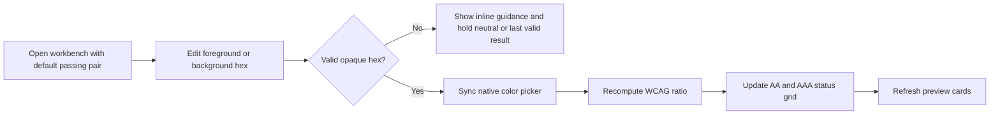
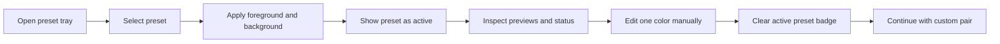
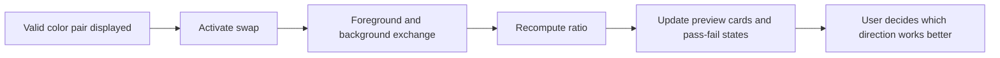

# UX Specification -- contrast-workbench-spark-0606

## UX Intent

The product should feel like a focused accessibility instrument, not a generic form. The fastest path is a single responsive workbench where inputs, ratio results, and previews remain visibly connected. Desktop should support side-by-side evaluation. Mobile should preserve the same information hierarchy through stacked cards without hiding critical status.

## User Flows

### Flow 1: Evaluate A Custom Color Pair

### Flow 2: Apply Preset Then Fine-Tune

### Flow 3: Compare Reverse Usage

## Key Screens

### Screen 1: Desktop Contrast Workbench

**Purpose:** Primary desktop view for evaluating a pair, understanding pass-fail results, and comparing UI previews at the same time.

**Entry points:** Initial page load, reload with default colors, future direct URL entry if added later.

**Key elements:**
- Header with product name and one-sentence scope note.
- Color control panel with foreground/background hex fields, native pickers, and swap action.
- Results panel with ratio, AA/AAA grid, and brief threshold guidance.
- Preset rail with curated starting combinations.
- Preview grid with heading, body, button, and muted text samples.

**States:**
- **Loading:** Minimal shell or skeleton for less than one interaction cycle; no spinner-heavy behavior needed for a static app.
- **Initial:** Default valid pair renders ratio, status grid, and previews immediately.
- **Invalid input:** Inline field guidance appears, invalid field is identified, and assessment area shows neutral or last valid state without pass-fail misinformation.
- **Valid edited state:** Ratio, statuses, and previews update together after each valid change.

**Accessibility notes:**
- Each input must have a visible label, programmatic label, and helper text linked with `aria-describedby` when invalid.
- Swap, preset chips, and any status explanations must be keyboard reachable in logical order.
- Pass and fail states must use text and iconography, not color alone.
- Control boundaries and focus rings must meet non-text contrast expectations.

**Performance notes:**
- All screen behavior is local and synchronous; no loading dependency should block first useful interaction.
- Recalculation should feel instantaneous even during rapid typing.

**Wireframe:**

  

    <b>Contrast Workbench</b>
    WCAG text contrast evaluator
  

  

    

      
Inputs

      
Foreground [#1F2937] [picker]

      
Background [#F9FAFB] [picker]

      

        
Swap

        
Reset

      

      
Presets

      

        
Ink / Sand

        
Ocean / Mist

        
Warning Example

      

    

    

      

        

          
Ratio

          
12.63:1

        

        

          

            
AA Normal Pass

            
AA Large Pass

            
AAA Normal Pass

            
AAA Large Pass

          

        

      

      

        
Heading preview

        
Body preview

        
Button preview

        
Muted text preview

      

    

  

Mobile wireframe (375px+):

  

    <b>Contrast Workbench</b> 
    WCAG text contrast evaluator
  

  

    
Foreground [#1F2937] [picker]

    
Background [#F9FAFB] [picker]

    
Swap colors

    
Ratio 12.63:1 + AA/AAA chips

    
Preset chips

    
Heading preview

    
Body preview

    
Button preview

    
Muted preview

  

### Screen 2: Validation Assist State

**Purpose:** Make malformed or unsupported input recoverable and obvious without losing user orientation.

**Entry points:** Typing malformed hex, removing the `#`, entering too few or too many digits, or using alpha syntax such as `#RRGGBBAA`.

**Key elements:**
- Inline field error under the affected control.
- Neutral results card with short explanation.
- Preserved preview shell so the layout does not jump.
- Optional "use last valid colors" or reset action if implementation chooses to include it.

**States:**
- **Single invalid field:** Only the affected field shows guidance; the other control remains interactive.
- **Both invalid:** Ratio state becomes neutral and all pass-fail chips are suppressed or marked unavailable.
- **Recovered:** Guidance clears as soon as both values are valid again.

**Accessibility notes:**
- Error text should be announced politely and linked to the field.
- Invalid state cannot be signaled by red styling alone.
- Focus should remain stable while typing; no sudden focus steals on validation.

**Performance notes:**
- Validation occurs inline with no debounce required for short hex fields.
- The UI should not remount major sections during error transitions.

**Wireframe:**

  
<b>Input guidance</b>

  

    

      
Foreground [#12Z89Q]

      
Use `#RGB` or `#RRGGBB`. Transparency is not supported in v1.

    

    

      Ratio unavailable until both colors are valid. Last valid preview may remain visible with a clear "stale result" note.
    

  

Mobile wireframe (375px+):

  
<b>Input guidance</b>

  

    
Foreground [#12Z89Q]

    
Use `#RGB` or `#RRGGBB`. Transparency is not supported.

    
Ratio unavailable until both values are valid.

  

## Interaction Rules

- Hex inputs are canonical. Picker changes update hex fields; invalid freeform text never silently rewrites to another value.
- When a preset is active, its chip is highlighted. Any manual edit clears the active preset state.
- Swap happens only when both current values are valid colors. If implementation allows swap while invalid, it must preserve field contents exactly and not fabricate a ratio.
- Preview cards use the selected pair consistently, but muted/supporting text may intentionally apply reduced type size to demonstrate why the same pair can feel weaker in practice.

## Content Rules

- Result labels must say `Pass`, `Fail`, or `Unavailable`; avoid ambiguous copy like `Good` or `Weak`.
- Guidance copy should explain the supported formats in one line.
- The page should include a compact note that the workbench evaluates flat foreground/background text contrast, not gradients, images, or overlays.
