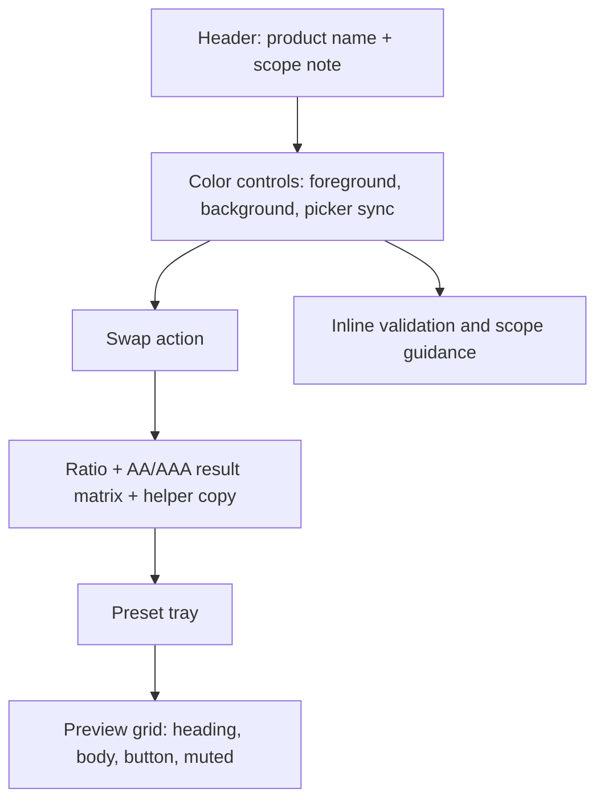
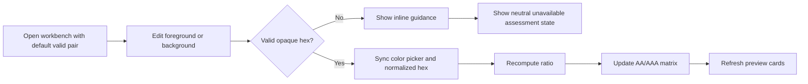
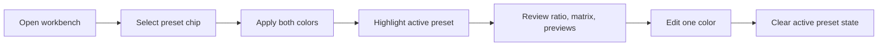
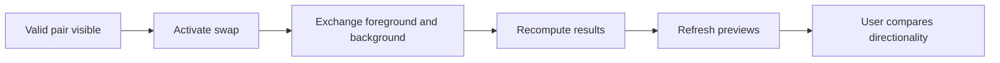
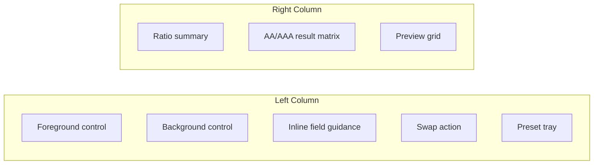
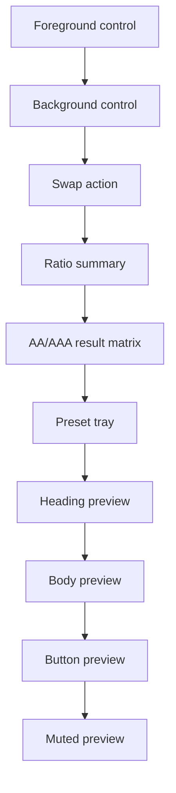

# UX Specification -- contrast-workbench-spark-0606

## UX Intent

The product should feel like a precise accessibility instrument with enough visual polish to invite exploration. It should not read like a generic form or a toy calculator. Users need to understand three things at once: the chosen colors, the compliance outcome, and how the pair behaves in context. The UX should keep those three views visibly connected on both desktop and mobile.

## Information Architecture

## Primary User Flows

### Flow 1: Evaluate A Custom Pair

### Flow 2: Apply A Preset Then Fine-Tune

### Flow 3: Compare Reversed Usage

## Responsive Layout Specification

| Breakpoint | Layout | Behavior |
|------------|--------|----------|
| `375px` to `767px` | Single-column stack | Inputs first, then swap, then ratio/matrix, then presets, then previews |
| `768px` to `1023px` | Single-column or `2-up` preview grid | Controls and results stay near the top; preview cards may switch to two columns if space allows |
| `1024px` to `1440px` | Two-column desktop workbench | Left column for controls/presets, right column for results and previews |

### Desktop Behavior

- The workbench uses two primary columns.
- The left column contains both color controls, inline validation, swap action, and preset tray.
- The right column contains the ratio summary, AA/AAA matrix, and preview grid.
- On a common laptop viewport, the ratio and at least the first row of previews should be visible without excessive scrolling.
- The result summary stays visually above previews so users see the computed meaning before the contextual samples.

### Mobile Behavior

- The product remains a single-screen workbench conceptually; sections stack instead of moving behind navigation.
- The stack order is fixed: controls, swap, result summary, preset tray, preview cards.
- Preview cards become single-column and keep consistent padding and heading size.
- Input and action controls use touch-friendly target sizes.
- No section should force horizontal scrolling in the primary path.

## Screen Anatomy

### Screen 1: Desktop Workbench

Key details:

- Foreground and background controls use mirrored structure so the pair feels symmetrical.
- Each control shows a visible label, current hex field, and native picker.
- Swap sits between the control cluster and the results cluster, visually communicating direction change.
- Presets sit below the controls because they are secondary to custom entry, but above previews because they directly affect the current state.

### Screen 2: Mobile Workbench

Key details:

- Ratio summary and matrix remain above presets and previews so the verdict is visible before exploratory content.
- Preview cards remain full-width to avoid cramped text and to preserve legibility of the selected pair.
- Preset chips may wrap to multiple rows but must not cause horizontal overflow.

## Component Specifications

| Component | Required Behavior | UX Notes |
|-----------|-------------------|----------|
| Foreground/background controls | Accept freeform hex typing and valid picker changes | Hex field is canonical; picker reflects the last valid normalized uppercase hex value |
| Inline validation | Appears directly below the affected field | Message format should be short and corrective, not punitive |
| Swap action | Exchanges current values in one action | Disabled or neutralized when swap cannot produce a valid assessment |
| Ratio summary | Shows large `X.XX:1` value or `Unavailable` | Remains visually prominent across breakpoints |
| Result matrix | Shows four threshold outcomes | Must use labels and status icons, not color alone |
| Preset tray | Applies bundled color pairs and highlights active preset | Includes both passing and failing examples |
| Preview cards | Render live samples for four text roles | Labels must make the role explicit |

## Validation And Error-State Behavior

### Invalid Entry Rules

- Validation runs inline while the user types.
- A malformed or unsupported value does not auto-correct to a different valid hex.
- Guidance copy should explicitly state the accepted formats: `#RGB` and `#RRGGBB`.
- Alpha syntax such as `#RGBA` or `#RRGGBBAA` must be called out as unsupported in v1.

### Assessment-State Rules

| State | Trigger | UI Response |
|-------|---------|-------------|
| Valid | Both fields contain supported opaque hex values | Ratio, matrix, and previews update immediately |
| Invalid one field | One field becomes malformed or unsupported | Show field-level guidance and replace the assessment with `Unavailable` |
| Invalid both fields | Both fields are invalid | Suppress authoritative result claims and show neutral guidance |
| Recovered | Both values are valid again | Remove guidance and resume live assessment |

## Interaction Rules

- Hex inputs are canonical. Picker changes update the field value only when the resulting value is valid and supported.
- Valid shorthand hex normalizes to six digits for calculation and picker synchronization.
- Manual editing of either field clears active-preset styling.
- Swap must not silently convert invalid text into a valid assessment.
- Result and preview updates should feel immediate; no explicit submit or debounce is needed for short inputs.

## Accessibility Requirements

- Every control has a visible label and programmatic label.
- Helper text is associated with the correct field using accessible descriptions.
- Keyboard users can reach controls, presets, and previews in the same order they appear visually.
- Focus indicators meet non-text contrast expectations and remain visible against both light and dark surfaces.
- Result states communicate meaning with text and a non-color visual cue.
- The interface includes a short scope note clarifying that the tool evaluates flat text/background contrast, not gradients, overlays, or images.

## Content And Microcopy

### Preferred Labels

- `Foreground`
- `Background`
- `Contrast ratio`
- `AA normal text`
- `AA large text`
- `AAA normal text`
- `AAA large text`
- `Pass`
- `Fail`
- `Unavailable`

### Preferred Guidance Copy

- `Use #RGB or #RRGGBB. Transparency is not supported in v1.`
- `Large text uses WCAG's lower threshold; normal body text still needs the stricter value.`
- `This workbench evaluates flat text/background color pairs only.`

## UX Acceptance Notes

- Desktop and mobile should preserve the same causal story: choose colors, understand the result, then inspect contextual previews.
- The result summary and matrix are not secondary content. They are the trust anchor of the page and must remain visually dominant.
- Presets and previews add value only if they stay honest about their purpose. They should guide exploration, not imply full-product compliance.
